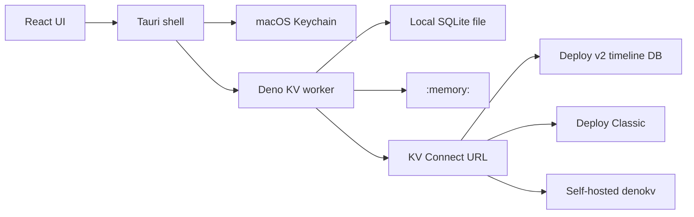

# Deno KV desktop app (macOS)

## Product

A Mac app for inspecting and editing Deno KV. Each saved connection is one database. Production, preview, and git-branch data are separate databases on Deno Deploy, not modes of a single database. The UI labels them and gates writes on production.

Stack (fixed so later tasks do not re-decide it):

- **Tauri 2** shell, macOS only for v1
- **React + TypeScript + Vite** UI
- **Deno sidecar** is the only process that calls `Deno.openKv`. Local SQLite KV exists only inside Deno; the same API also opens remote KV Connect URLs



## Supported databases

Every target is `Deno.openKv(...)` plus an environment label.

- **Local file** — `Deno.openKv(path)` (SQLite)
- **Memory** — `Deno.openKv(":memory:")`, gone when the connection closes
- **Deploy timeline** — `https://api.deno.com/v2/databases/<database-id>/connect` with `DENO_KV_ACCESS_TOKEN` (`ddo_...`, personal or org). One database id per timeline. Names follow `{app-id}-production`, `{app-id}-preview`, and `{app-id}--{branch-name}`. Preview is one shared database per app today
- **Deploy Classic** — `https://api.deno.com/databases/<database-id>/connect` with the same token
- **Self-hosted / other** — any KV Connect URL and its access token

Reads in the GUI use strong consistency. Tokens stay in the macOS Keychain. Connection metadata (name, kind, path or URL, environment label) is stored without secrets.

## Distribution

Ship a **Developer ID–signed, notarized DMG** outside the Mac App Store. The Deno sidecar stays. The App Sandbox stays off. Hardened runtime is on, with `com.apple.security.cs.allow-jit` (and `allow-unsigned-executable-memory` only if the compiled worker crashes without it).

The Mac App Store is out of scope. It requires the App Sandbox, and a V8 sidecar is a poor fit for review: JIT entitlements, sandbox file access, and per-binary signing. Revisit only if distribution later moves to an in-process Rust KV engine.

## Use cases

- Save and switch connections, with a visible badge: `local`, `memory`, `production`, `preview`, `branch`, `classic`, or `self-hosted`
- Browse keys by prefix (key parts, not raw strings). Page with limit, start, and reverse
- Look up one entry by its exact key, including a clear not-found result
- Create, update, and delete one entry
- Open an entry: key parts, versionstamp, and the real value type
- Edit safely with an atomic check on the versionstamp so a stale write fails
- Adjust `KvU64` counters with sum, min, and max
- Delete, export, or import a prefix. Export keeps types (`KvU64`, `bigint`, bytes, `Date`), not lossy JSON
- Production writes, deletes, and prefix operations ask for confirmation that names the database
- Pick a Deploy database by pasting its id, or by listing databases when the token’s API allows it

Out of scope: provisioning databases, Postgres, Windows/Linux installers, and multi-user sync.

## Value and key codec

Keys and values cross the UI as tagged JSON so types survive the round trip. Key parts: `string`, `number`, `bigint`, `boolean`, `bytes`. Values: JSON-like data plus `bigint`, `bytes`, `date`, and `u64`. The worker converts tags to and from `Deno.KvU64`, `Uint8Array`, and `bigint` before calling KV.

Worker protocol is newline-delimited JSON on stdin/stdout: `ping`, `open`, `close`, `list`, `get`, `set`, `delete`, `atomic`. Tauri spawns `deno` with `--unstable-kv` and explicit allow flags. Dev mode uses `deno` on `PATH`. The package task compiles the worker with `deno compile` and bundles that binary.

## Entry operations

These four operations, plus exact lookup, are required. Later tasks must not drop them.

- **List** — `kv.list` by prefix, with paging. This is browsing, not lookup.
- **Lookup** — `kv.get` on the full key. The UI has a key-part field the user fills in, then shows the value and versionstamp, or not found. A missing key is not an error.
- **Create** — `kv.set` for a key that has no value yet.
- **Update** — `kv.set` on an existing key, replacing the value. The editor loads the current value first.
- **Delete** — `kv.delete` for one key. Deleting a missing key is a no-op and the UI says the key is gone.

## Agent operating rules

These rules are the implementation contract. The first coding session writes them to [docs/AGENT.md](docs/AGENT.md) and the task list to [docs/TASKS.md](docs/TASKS.md), copying the tasks below. After that, every session follows the files, not memory.

- Do exactly one task: status `pending`, and every id in `depends` is `done`.
- Set that task to `in_progress` before editing product code. Leave `started` as the date.
- Touch only the files that task needs. If new work appears, append a `pending` task. Do not do it in the same session.
- Run the task’s verification. On success set `done`, and write what changed and the command output summary in `notes`.
- On failure set `blocked`, write the blocker, and stop. Do not start the next task.
- Do not mark `done` without verification. Do not commit unless the user asks.
- Stop after one task and report: task id, new status, verification result.

Status values: `pending`, `in_progress`, `blocked`, `done`.

Session prompt to paste at the start of each implementation turn:

```text
You are implementing the Mac Deno KV app in this repo.
Read docs/AGENT.md and docs/TASKS.md.
Choose the single eligible task (pending, dependencies done).
Set it to in_progress, implement only that task, run its verification, then set done or blocked.
Update docs/TASKS.md in the same session.
Stop after that task and report id, status, and verification.
```

## Tasks

Each task lists depends, done when, and verification. Status starts at `pending`.

**T1 — Agent docs and app shell**
Depends: none.
Create `docs/AGENT.md`, `docs/TASKS.md`, Tauri 2 + Vite React TS app, and `sidecar/main.ts` that answers `ping`. The window shows the app name and the worker’s ping result.
Verify: `deno check sidecar/main.ts`; `npm run tauri dev` shows the ping (or `cargo check` in `src-tauri` plus a Deno ping test if the GUI cannot be launched).

**T2 — Connection records and Keychain**
Depends: T1.
Define the connection type (id, name, kind, environment, path or URL, database id). Persist records in the app data dir with no token field. Save and load the access token through the macOS Keychain plugin, keyed by connection id.
Verify: Rust/TS unit test or a small Tauri command test that round-trips a token and asserts the JSON file has no secret.

**T3 — Open every KV target**
Depends: T2.
Worker `open` / `close` for local path, `:memory:`, and remote URL. Remote open receives the token only as the child env `DENO_KV_ACCESS_TOKEN` for that process. UI can add a connection and shows connected or the error. Environment badge is user-selected; if the database name ends with `-production`, `-preview`, or `--<branch>`, suggest that label.
Verify: `deno test` opens `:memory:` and a temp file, writes one key, reads it back, closes. Remote open is covered by a mocked URL failure test plus a manual note if no token is available.

**T4 — Typed codec**
Depends: T3.
Implement the tagged codec and tests for key parts and values: string, number, boolean, null, object, array, bigint, bytes, date, u64. Reject unsupported values with a clear error.
Verify: `deno test sidecar/`.

**T5 — List, lookup, create, update, delete**
Depends: T4.
Worker methods:

- `list` (prefix, start, end, limit, reverse) returns key, tagged value, versionstamp, and a cursor when the page is full
- `get` looks up one exact key and returns the entry or not found
- `set` creates or updates that key
- `delete` removes one key

Verify: `deno test` against `:memory:` covering prefix paging, exact get of a stored key, get of a missing key, create, update of the same key, and delete.

**T6 — Connections screen**
Depends: T5.
UI to add, rename, remove, and connect. Forms for local path, memory, and remote (URL or database id + which URL shape: v2, classic, or custom). Show environment badges. Only one active KV session.
Verify: in the running app, create a memory connection and a temp-file connection, connect, disconnect, and relaunch to confirm records persist and tokens are not in the JSON file.

**T7 — Key browser, lookup, and editor**
Depends: T6.
Prefix breadcrumb and paged key list. A lookup field accepts the full key and calls `get`. Entry panel supports create, update, and delete with type controls for the codec, and shows the versionstamp. Lookup of a missing key shows not found without writing anything.
Verify: in the app, against a temp local file, create nested keys, page a prefix, look up one exact key, update its value, look up a key that does not exist, delete a key, and confirm the surviving keys are still there after reconnect.

**T8 — Atomic writes, counters, production guard**
Depends: T7.
`set` and `delete` can pass the expected versionstamp and fail with a conflict error if it changed. UI actions for sum, min, and max on `u64`. Any write or delete on `production` requires a confirm dialog that includes the connection name.
Verify: `deno test` for check conflict and `KvU64` sum. In the app, mark a local connection as production and confirm a write is blocked until the dialog is accepted.

**T9 — Prefix delete, export, import**
Depends: T8.
Export and import a prefix with the tagged codec. Prefix delete lists the count and asks for confirmation; production also uses the production dialog.
Verify: `deno test` export/import round trip including `u64` and bytes. In the app, export a prefix, delete it, import it, and see the same keys.

**T10 — Deploy database list**
Depends: T9.
With a stored token, call the current Deno Deploy HTTP API to list KV databases for the account or org. Map each row to a connection draft: name, database id, v2 or classic connect URL, and environment parsed from `-production`, `-preview`, or `--branch`. If the list API is unavailable, keep manual id entry and record the blocker on this task only if manual entry is also broken. Do not invent an undocumented API; check Deno’s docs in that session.
Verify: unit test the name-to-environment parser. If a token is present, list results show up in the picker; otherwise document the manual path as the check.

**T11 — Notarized macOS DMG**
Depends: T10.
`deno compile` the worker and configure Tauri to ship it as a sidecar. Sign with a Developer ID certificate, enable the hardened runtime, notarize, and staple a DMG. Document install: download the DMG, open the `.app`, pick local files in the native file dialog. Do not enable the App Sandbox and do not submit to the Mac App Store.
Verify: `tauri build` produces a notarized DMG. The stapled `.app` launches, pings the bundled worker, and opens a local KV file without a system `deno` on `PATH`. `spctl` assesses the app as accepted.
